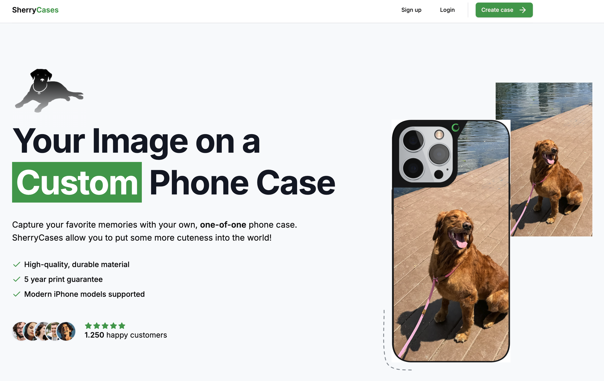
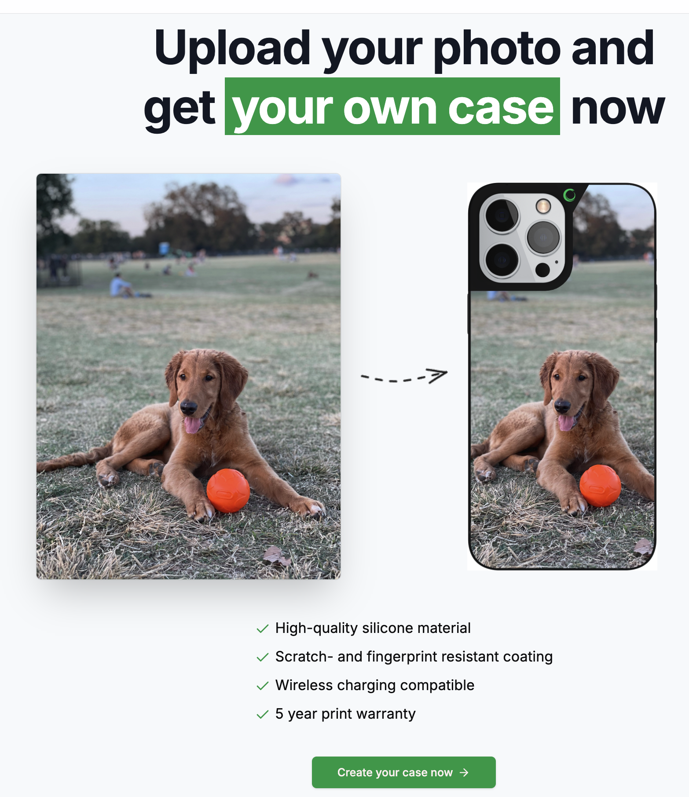
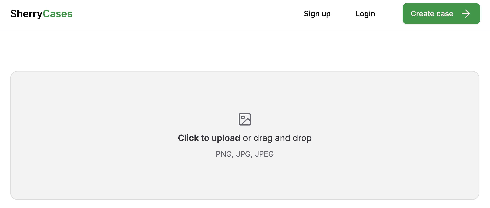

 

<!--  -->
<h2 align="center">SherryCases</h2>

eCommerce project!
 
 

## About

This is a website that advertises a customizable phone case. The site provides the ability to drag and drop a photo and customize your personalized iPhone case. The application is a stylized interface designed to convert viewers into customers.
  
**Features the two best looking members of the Sherry household.**

### Tech Stack

- [Next.js](https://nextjs.org/)
- [React](https://react.dev/)
- [Shadcn/ui](https://ui.shadcn.com/)
- [Typescript](https://www.typescriptlang.org/)
- [TailwindCSS](https://tailwindcss.com)

### How to run

Clone the repository and run the command `npm run dev`, then follow the link.

### Screenshots

 

### To Do (WIP)

Database connection to store user credentials

